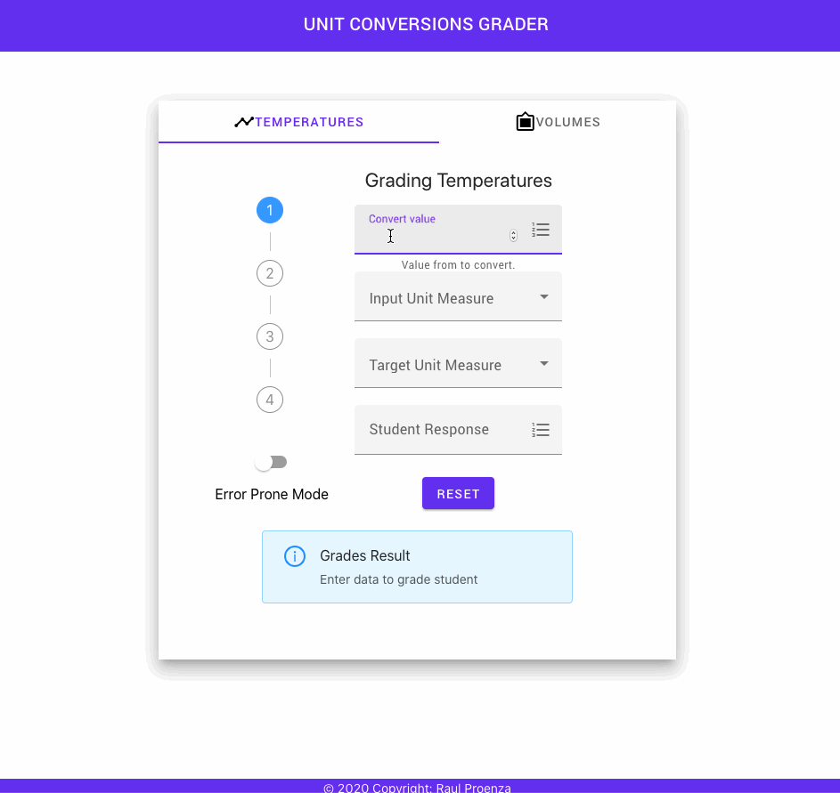

# [Unit Conversion Grading](https://unit-conversion-grader.web.app)

> CI/CD powered by  [GitHub Actions](https://help.github.com/en/actions/automating-your-workflow-with-github-actions)

| [Continuos Integration(CI)](https://en.wikipedia.org/wiki/Continuous_integration) | [Continuos Deployment(CD)](https://en.wikipedia.org/wiki/Continuous_deployment) |
| :---: | :---: |
|   |   |

## Table of Contents

- [Description](#description)
- [Technical Information](#technical-information)
- [Project management](#project-management)
- [Continuos Delivery](#continuos-delivery)
- [How to use](#how-to-use)
- [Development Operations](#development-operations)
- [Support](#support)
- [License](#license)

## Description

This is a web application for allowing science teachers to grade unit conversion problems submitted by students.

### How it works

Teachers assign students unit-conversion problems on paper worksheets. After students turn in their completed worksheet, the teachers will use this web app enter the questions and student responses into a computer to be graded.

**Students will convert the following units:**

  - **Temperatures:** ​Kelvin, Celsius​,​ Fahrenheit​, and​ Rankine
  - **Volumes​: ​Liters:**​ ​Tablespoons​, ​Cubic-inches, Cups​,​ Cubic-feet, ​and​ Gallons

Note: the app does not allow conversion between invalid units.

## Technical Information

These project is a ReactJS, Github and Firebase workshop. The following technologies and methodologies were used to implement the application:

- JavaScript Frameworks
  -  ReactJS and Jest
- Components Libraries
  - Material Components for React (MDC React) by Google Material Design team
  - Ant Design by Ant Design Group
  - React Suite by HYPERS
- Workflow Automation
  - [GitHub Actions](https://github.com/rproenza86/unit-measure-conversion-judge/actions)
- Project Management
  - [GitHub Projects](https://github.com/rproenza86/unit-measure-conversion-judge/projects/1)
- Software Development Methodology
  - Scrum with Kanban influences

## Project Management

Since this is a small project, I used GitHub Projects to manage the project though normally I would use Jira. Adopting Github organizational tooling to support the SDLC of this project.

Following a Scrum/Kanban methodology, the artifacts were mapped in the following manner:

- Product Backlog - Github Issues
- Sprint Backlog - Github Projects - ToDo column
- Product Increment - Github Projects Board
- Epics - Github Milestone
- Story - Github Issue

The stories where grouped in Epics, moved into the project board stages from ToDo - In Progress - Review in Progress - Reviewer Approved - Done.

For development process I used the following branch-based workflow:

1. Branch from master on each new code change request
2. Prefix branch names with `{type of work}/us{issue number}/{description}` Ex. `feat/us21/sass-migration`
3. To merge new code additions a Pull Request is created, each PR is linked to a given Issue, the PR is validated running by the CI and is it pass the checks and coverage threshold it will be merged into the master branch
4. On code commit into the master branch a CD process it triggered, unit tests are ran and on success the app is build and deployed to Firebase hosting
5. Once the PR is merged the linked issue is closed automatically and moved to the Done stage

    - Created 4 epics/milestones

    - The Project board has automation in place to move stories from stages. Ideally I would created one Github Project on this repo for each sprint but I consider it overkill for these small project

## Continuous Delivery

Using Continuous Integration as software development practice to automate the code testing process and Continuous Delivery to automating the entire software release process.

To support the CI/CD initiative two automation work load were created:

1. For CI [Pull Request Unit Test Check](.github/workflows/pullrequesttest.yml)
2. For CD [Firebase Hosting Deployment](.github/workflows/hostingdeployment.yml)

## How to use

### Web application access

The web application is accessible on the next url : https://unit-conversion-grader.web.app

<!-- TODO: Update video with better and shorter capture -->

### Development Operations

In the project directory, you can run:

#### `npm start`

Runs the app in the development mode. 
Open [http://localhost:3000](http://localhost:3000) to view it in the browser.

#### `npm test`

Launches the test runner in the interactive watch mode. 
See the section about [running tests](https://facebook.github.io/create-react-app/docs/running-tests) for more information.

#### `npm build`

Builds the app for production to the `build` folder. 
It correctly bundles React in production mode and optimizes the build for the best performance.

The build is minified and the filenames include the hashes. 
Your app is ready to be deployed!

See the section about [deployment](https://facebook.github.io/create-react-app/docs/deployment) for more information.

#### `npm run deploy`

Deploys the latest build to Firebase hosting.

## Support

 Create an [Issue](https://github.com/rproenza86/unit-conversion-grader/issues) for any bug or feature request.

 Expect a response within 2 business days after submitted your [bug report or feature request](https://github.com/rproenza86/unit-conversion-grader/issues). However, in many cases you'll see a response within 24 hours.

## License

- **[GNU General Public License version 3](LICENSE)**
- Copyright 2025 © <a href="http://raulproenza.page" target="_blank">Raul Proenza</a>.